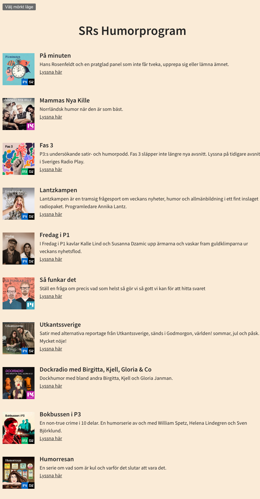
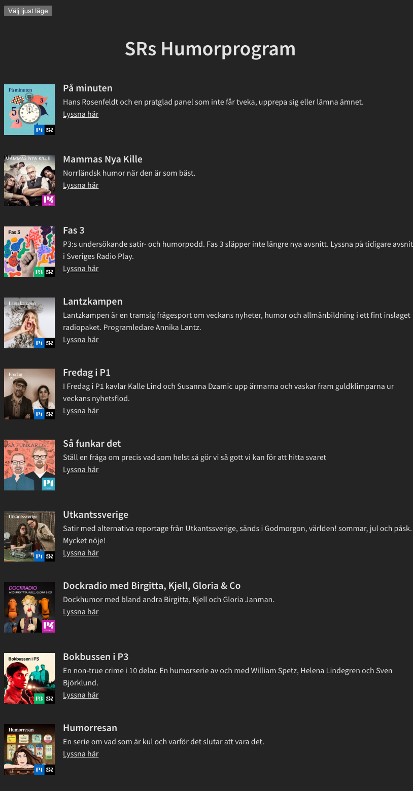

# FIX THE (VERY) BAD CODE 

## Description

SR's Humorprogram

Welcome to SR's Humorprogram, an interactive webpage built as a student assignment at Medieinstitutet. The project allows users to toggle between light and dark modes and explore humorous podcast listings from Sveriges Radio. 

This project was part of a course where we practiced reading someone else's code, eliminating code smells, and understanding error messages. Alongside this, we also got to practice TypeScript, HTML, CSS, API integration, and working with plugins such as ESLint, Vite, and SCSS.

## Project Overview
We were given an old fictitious project where we had to implement a number of changes to make it work seamlessly. For instance, we had to integrate ESLint and TypeScript into the project. We also had to debug the code, as it had several built-in errors.

**Features:**
- **Light Mode Toggle**: Users can switch between light and dark modes on the page with a simple button.
- **Responsive Design**: The page is designed to work well on both desktop and mobile devices.
- **Podcasts**: The page fetches and displays podcasts from an API, showing the image, name, description, and link.

## Installation

To run the project locally, follow these steps:

1. **Clone the repository**:
   ```bash
   git clone <https://github.com/Medieinstitutet/fed24d-arbetsmetodik-inl-1-AgnesWilson>
2. **Run these comands in the terminal**:
   ```bash
    pnpm install
    pnpm run build
    pnpm run dev (to run the development version)
    pnpm run preview (to run a preview of the live version)

## Tech Stack


    


 


 

# Screenshots
Here are some screenshots of the page in mobile view, in both dark and light mode, and also in development mode:





# Links

**Reports**
- [Lighthouse-report](assets/lighthouse.png)
